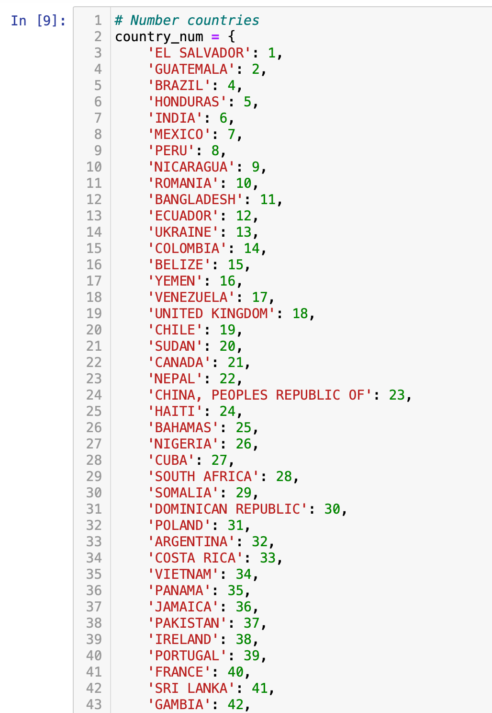
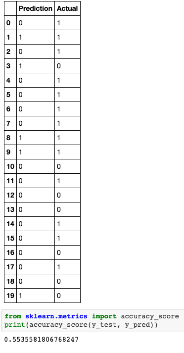

# U.S. Customs and Border Protection and Child Detentions 

## Introduction to Topic 

This project aims to identify which factor(s), if any, influence the amount of time minors are detained by U.S. Customs and Border Protection (CBP) in order to build a model that can predict how much time one is likely to spend in CBP custody -- or see if it is feasible with the data given.  

### Reason for Selecting Topic 

Considering the detention of minors by CBP has been a major topic in public discourse -- particularly over the past three or four years, pulling insights from the data could allow us to identify trends and address potential detrimental impacts of the detentions.  

### About the Data Source

This project uses [data](https://github.com/themarshallproject/cbp-migrantchildren-detention-data) collected by The Marshall Project from CBP via a Freedom of Information Act request. The CSV contains more than 580,000 rows of data covering each time the agency detained migrant children since January 20, 2017.  

The data points provided include: 
- dates of detention and release
- hours spent in custody
- age group
- gender
- citizenship
- border of entry

### Questions the Data Could (Tentatively) Answer

Possible questions we could answer from this data include: 
- How much time is one likely to spend in CBP custody once we know their age, country of origin, and/or gender. 
- Are certain age groups more likely to be detained? Or are certain age groups detained for a longer time than others? 
- Does country of origin play a role in likelihood of detention or time spent detained? 
- Do we see bias in certain groups that are detained for a longer period of time? 
- Can we predict how long one may spend in detention based on those biases? 
- How are age groups distributed based on country of origin? do certain countries have more representation among certain age groups? 

## Data Preprocessing / Feature Engineering 

### Cleaning the Data

#### Removing Features

I started off by removing five features: 
- Application date: A majority of cells contained null values. 
- Border: The U.S. southern border accounted for an overwhelming majority of the detentions, so I removed it from the dataset used for the machine learning model because I would not be able to make proportionate comparisons based on border. However, I kept the column for an exploratory data analysis in Tableau to see just how disproportionate the number of detentions was for those intercepted at the southern border. 
- Sector / Source: These were clerical inputs that were not applicable to the analysis or model. 
- Field Office: This column contained too many null values.

I also used the ```.dropna()``` function to remove null values in the left over columns. 

#### Numericize and Conform Values

To make the data more uniform and numericize it for testing machine learning models, I did the following: 
- In the date in and out fields, I removed the time stamp and changed data type from object to datetime.
- I assigned numbers to the countries, genders and age groups:
    
    
    
- For hours spent in custody, I rounded the amounts to the nearest tenth.

#### Break up Certain Points for Details

To expand my options for the exploratory analysis and possibly prep for the machine learning models, I also 
- I split off the date in and out fields down to month and year in separate columns to explore whether those features individually could impact time spent in custody. 
- To add another option for time spent in custody, I added a column for days spent in custody by dividing hours spent detained by 24 and adding a series from the results. 


## Exploratory Analysis & Machine Learning 

### Exploration Ahead of Analysis

I knew based on the  description of hours in custody that there were major outliers, so I created a boxplot to get a visual and saw that outliers definitely needed to be cut.  


After getting a description of the hours spent in custody following a log transformation, I identified the upper outliers by subtracting the first quartile from the third quartile to get the inter-quartile range, multiplying it by 1.5 and then adding it to the third quartile, which gave me 168.13. As such, I cut any values that exceeded 168.13 to remove outliers. 


### Testing Models

To do an initial check on any correlations, I created a correlation map and found that there were not significant associations between the features, which indicated that there were not linear relationships between. 


#### Multilinear Regression

I used a multilinear regression model looking at age group, gender and country to confirm the findings from the correlation map that there was no linear relationship. 


#### Logistic Regression

I then looked into doing a logistic regression model to look at a binary option and determine if any of the features could help predict whether someone would spend more time than average in detention or not. 

For this model, I used the days_in_custody values and identified the average amount of hours spent in custody from that. I then created a new column with values of 0 (indicating the individual did not spend more time than average in detention) and 1 (individuals who did spend more time on average in detention). 

In the end, the model was able to determine with a ***55% accuracy score*** whether an individual would spend more time on average in custody based on age group, gender, date in, date out and country of origin. 



#### Decision Tree & Random Forest

Given that the regression models were not detecting any correlations between input variables (country of origin, age, gender, date in, or date out) and whether detainees would spend more time than average in custody despite an exploratory analysis finding bias in the data, I built decision tree and random forest models to consider the input variables when combined with each other. Both models came out with with an accuracy score of 70% -- a marked improvement from the regression models. 

##### Decision Tree


##### Random Forest


### Interesting Findings

An initial exploration of the data showed interesting trends in the areas of age group, gender and country of origin as it related to number of cases and average time spent in custody. 

1. Although girls make up fewer detentions in total (187.5K compared to boys who make up 300.3K), they spend more time on average detained at 74 hours compared to boys' 67 hours. 


2. Guatemalan nationals have the highest representation among detainees, making up 195.6K detentions, followed by Hondurans who account for 162.2K detentions. 

3. However, Hondurans are detained for more time on average at 75 hours, with Nicaragua and El Salvador coming in second with 74 hours on average in detention. 


4. Infants and toddlers (ages 0 through 2), have the lowest representation of detentions, but on average spend the most time detained, ranging 74-75 hours. 


## Visualization Plans

As can be seen in the Interesting Findings section, I will primarily use Tableau to visualize findings from this data and plan to incorporate more interactive graphics, including heat maps as seen below: 


